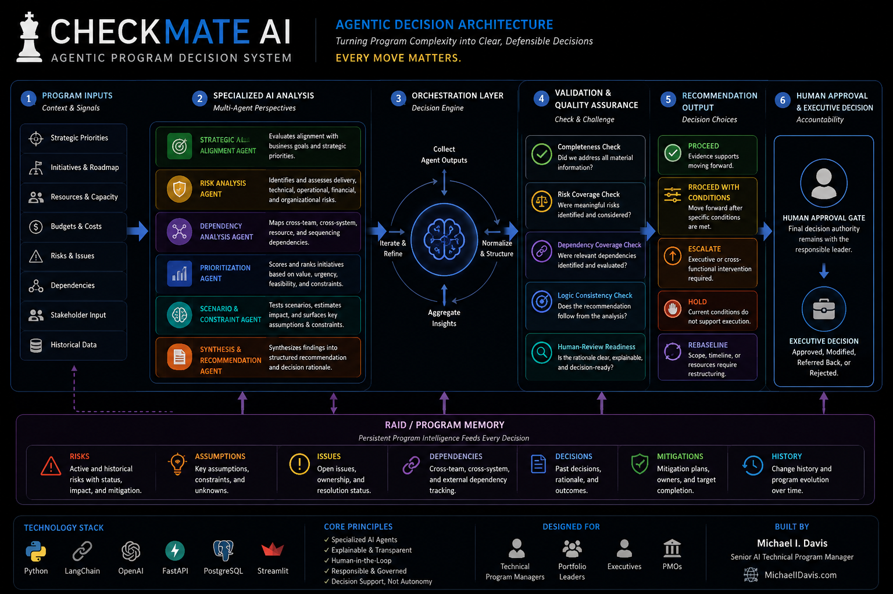
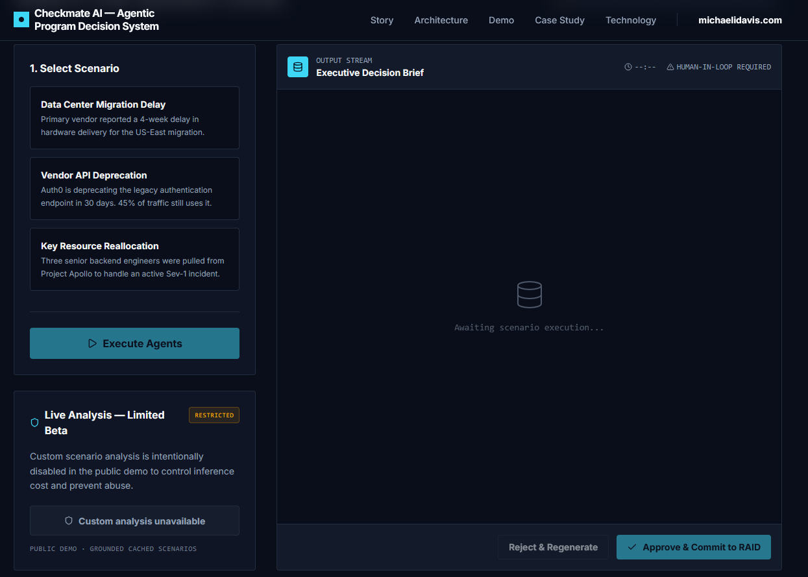
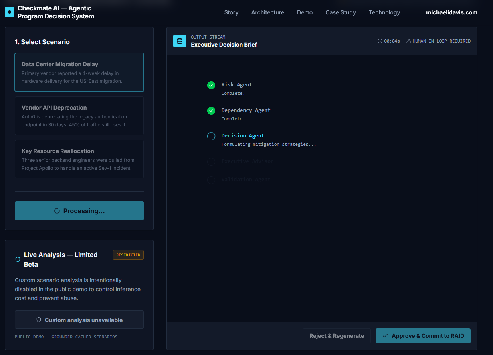
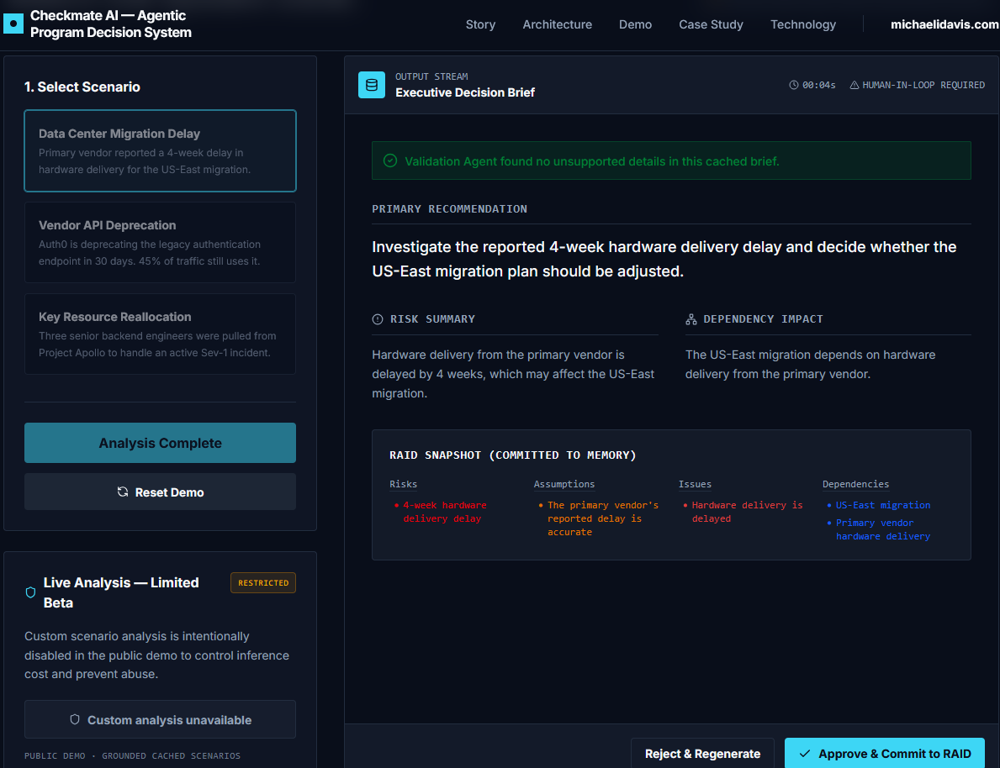

# ♟️ Checkmate AI
## Agentic Program Decision System

**Every Move Matters.**

An agentic AI decision-support system designed to help technical program leaders evaluate competing initiatives, identify delivery risks, analyze dependencies, prioritize resources, and generate explainable executive recommendations.

**Built by Michael I. Davis | Senior AI Technical Program Manager**

[🌐 Executive Portfolio](https://MichaelIDavis.com) · [🚀 Launch Live Demo](https://checkmate-ai-agentic-program-decision-system.replit.app/)

---

## Executive Overview

Enterprise program leaders rarely suffer from a lack of data. The larger challenge is turning fragmented program information into clear, defensible decisions.

Strategic initiatives compete for engineering capacity, funding, executive attention, and shared technical resources. At the same time, program leaders must account for dependencies, delivery risk, business value, stakeholder priorities, and incomplete information.

**Checkmate AI explores how agentic AI can transform those competing signals into structured decision intelligence.**

Rather than asking a single LLM to make a decision, Checkmate decomposes the problem into specialized analytical responsibilities and orchestrates those perspectives into an executive-level recommendation.

> **Checkmate does not replace program-manager judgment. It increases the amount of decision intelligence available when that judgment is required.**

---

## The Business Problem

Program and portfolio decisions frequently require leaders to reconcile:

- Competing strategic priorities
- Limited engineering and delivery capacity
- Cross-program dependencies
- Technical and operational risk
- Budget and resource constraints
- Stakeholder urgency
- Incomplete or inconsistent program data
- Changing delivery conditions

Traditional status reporting can explain **what is happening**.

Checkmate is designed to help answer:

> **Given everything we know, what should leadership do next — and why?**

---

## The Solution

Checkmate AI structures program information into a multi-stage decision workflow.

The system is designed to:

1. Capture program context and competing initiatives.
2. Analyze delivery risks and dependencies.
3. Evaluate strategic and execution considerations.
4. Compare competing priorities.
5. Identify assumptions and decision constraints.
6. Generate a structured recommendation.
7. Present the reasoning for human review.
8. Preserve executive accountability through an explicit human approval boundary.

The objective is **decision support, not autonomous executive authority**.

---

## Agentic Decision Architecture



### Architectural Principle

A complex enterprise decision should not be treated as one giant prompt.

Checkmate separates analytical responsibilities so individual stages can be evaluated, challenged, governed, and eventually replaced or extended independently.

This mirrors technical program management itself: specialized workstreams contribute evidence toward a coordinated decision.

---

## Analytical Responsibilities

Checkmate's decision workflow evaluates a program from multiple perspectives.

### Strategic Alignment

Examines the relationship between an initiative and stated business objectives.

### Risk Analysis

Identifies delivery, operational, organizational, and technical risks that could affect execution.

### Dependency Analysis

Surfaces cross-team, cross-system, resource, and sequencing dependencies.

### Prioritization

Evaluates competing initiatives against business value, urgency, constraints, and execution feasibility.

### Recommendation

Synthesizes the analytical findings into a decision-ready recommendation.

### Validation

Challenges whether the recommendation sufficiently accounts for known risks, dependencies, assumptions, and program context.

### Human Decision Authority

Preserves final accountability with the responsible program or executive leader.

---

## Decision Outputs

Checkmate produces structured decision recommendations rather than a generic AI response.

| Decision                    | Meaning                                                                                              |
| --------------------------- | ---------------------------------------------------------------------------------------------------- |
| **Proceed**                 | Available evidence supports moving forward.                                                          |
| **Proceed with Conditions** | Move forward after defined risks, dependencies, or prerequisites are addressed.                      |
| **Escalate**                | Executive or cross-functional intervention is required before proceeding.                            |
| **Hold**                    | Current conditions do not support execution.                                                         |
| **Rebaseline**              | Scope, timeline, resources, or assumptions require restructuring before a decision can be finalized. |

The recommendation is only one part of the output.

The system is designed to explain **why the recommendation was reached**.

---

## Human-in-the-Loop Governance

Checkmate follows a fundamental AI governance principle:

> **Automate analysis further than authority.**

AI can accelerate:

* Information synthesis
* Risk identification
* Dependency analysis
* Scenario comparison
* Prioritization analysis
* Recommendation generation

However, decisions involving significant capital, customer impact, regulatory exposure, workforce allocation, or strategic direction should retain explicit human accountability.

The final decision therefore remains outside the autonomous agent workflow.

---

## RAID & Program Memory

Enterprise decisions do not occur independently of program history.

A production-oriented version of Checkmate can incorporate persistent program memory covering:

* **Risks**
* **Assumptions**
* **Issues**
* **Dependencies**
* Previous decisions
* Decision rationale
* Mitigation commitments
* Ownership
* Status changes

This creates the foundation for longitudinal decision intelligence rather than isolated AI conversations.

---

## Evaluation Framework

Agentic systems require evaluation beyond whether an answer simply “sounds correct.”

Checkmate's evaluation approach considers:

### Completeness

Did the system address the material information provided?

### Scope Alignment

Does the recommendation actually answer the program decision being evaluated?

### Risk Coverage

Were meaningful execution and business risks incorporated?

### Dependency Coverage

Were relevant sequencing and cross-team dependencies considered?

### Recommendation Consistency

Does the final recommendation logically follow from the preceding analysis?

### Human-Review Readiness

Is the reasoning clear enough for a program leader to challenge, approve, reject, or modify?

---

## Representative Decision Scenario

### Data Center Migration Delay

The public demonstration includes a scenario in which a primary infrastructure vendor reports a **four-week hardware delivery delay** affecting a US-East data-center migration.

Checkmate evaluates the scenario as a program decision rather than simply summarizing the issue.


### Decision Intelligence Produced

The system generates several layers of program intelligence:

**Primary Recommendation**

> Investigate the reported four-week hardware delivery delay and decide whether the US-East migration plan should be adjusted.

**Risk Analysis**

The delayed hardware delivery may affect the planned US-East migration.

**Dependency Analysis**

The migration is dependent on hardware delivery from the primary vendor, creating a direct schedule dependency.

### RAID Memory

The system structures the scenario into persistent program intelligence:

| RAID Element | Identified Signal |
|---|---|
| **Risk** | Four-week hardware delivery delay |
| **Assumption** | Vendor-reported delay is accurate |
| **Issue** | Required hardware delivery is delayed |
| **Dependency** | US-East migration depends on primary-vendor hardware delivery |

This allows decision intelligence to become part of the program's operating memory rather than disappearing after an AI interaction.

### Validation Layer

Before presenting the decision brief, a validation step checks whether unsupported details have been introduced.

In this representative cached scenario, the validation layer reports that it found **no unsupported details in the brief**.

This illustrates an important design principle:

> AI-generated recommendations should be evaluated before they become decision artifacts.

### Human Decision Boundary

Checkmate does not automatically execute the recommendation.

The responsible program leader is presented with an explicit decision:

**Approve & Commit to RAID**

or

**Reject & Regenerate**

This maintains human accountability while allowing AI to accelerate analysis, synthesis, and program documentation.

---

### Why This Matters

The objective is not to have an LLM tell a program manager what to do.

The objective is to transform fragmented program signals into:

**Issue → Risk → Dependency → Recommendation → Validation → Human Decision → Program Memory**

That creates a traceable decision workflow instead of an isolated AI-generated answer.

---
## Agentic Workflow in Action

The public demonstration exposes the major stages of the Checkmate decision workflow so the system can be inspected rather than presented as a black-box AI response.

### 1. Grounded Scenario Selection



The public demo uses predefined, grounded scenarios. Custom analysis is intentionally restricted in the public environment to control inference cost, limit abuse, and avoid implying that the portfolio prototype is a production decision system.

---

### 2. Specialized Agent Execution



Once a scenario is executed, specialized analytical responsibilities operate sequentially:

**Risk Agent → Dependency Agent → Decision Agent → Executive Advisor → Validation Agent**

This decomposition allows each analytical responsibility to contribute to the final decision brief while maintaining a visible orchestration path.

The architecture intentionally separates responsibilities instead of relying on a single monolithic prompt.

---

### 3. Validated Executive Decision Brief



The resulting decision brief combines:

- Primary recommendation
- Risk analysis
- Dependency impact
- RAID classification
- Validation status
- Human approval controls

The Validation Agent checks the cached brief for unsupported details before the recommendation is presented for human review.

---

## Decision Lifecycle

The demonstrated workflow can be summarized as:

**Grounded Context → Risk Analysis → Dependency Analysis → Decision Analysis → Executive Synthesis → Validation → Human Approval → RAID Memory**

The final interface deliberately exposes:

**Reject & Regenerate**

and

**Approve & Commit to RAID**

This boundary is central to Checkmate's governance model: **AI performs analysis; humans retain decision authority.**
## Responsible AI & Security Considerations

A production implementation would require controls appropriate to the sensitivity of enterprise program data.

Key design considerations include:

* Data classification
* Least-privilege model access
* Secrets management
* Sensitive-data redaction
* Prompt-injection defenses
* Model-output validation
* Audit logging
* Retention policies
* Role-based access control
* Human approval thresholds
* Model and prompt versioning
* Decision traceability

Checkmate's public demonstration is intentionally separated from production-sensitive enterprise data.

---

## Public Demo Boundary

The public Checkmate experience is a **portfolio demonstration and prototype**.

It is intended to demonstrate:

* Agentic workflow design
* Program decision decomposition
* AI governance thinking
* Human-in-the-loop controls
* Executive recommendation structure
* Technical program leadership

It should **not** be interpreted as a claim of production deployment, benchmark accuracy, or realized enterprise ROI.

Any value examples associated with the prototype represent **modeled decision value**, not verified production outcomes.

---

## Production Evolution

A production implementation could extend Checkmate with:

**Enterprise Data Integration**

Jira • Azure DevOps • ServiceNow • financial systems • resource-management platforms • data warehouses

**Persistent Program Intelligence**

Historical RAID data • decision history • dependency graphs • milestone performance

**Retrieval-Augmented Generation**

Ground recommendations in approved enterprise documentation and program records.

**Identity & Access Management**

Enterprise authentication, RBAC, data classification, and auditability.

**AI Observability**

Model tracing, evaluation datasets, prompt/version management, latency monitoring, token utilization, and failure analysis.

**Decision Analytics**

Track recommendation acceptance, overrides, outcomes, recurring risks, and decision effectiveness.

---

## Product Roadmap

### Phase 1 — Decision Prototype

Structured program inputs, specialized analysis, prioritization, recommendation generation, and human review.

### Phase 2 — Program Intelligence

Persistent RAID memory, decision history, expanded evaluation, and richer dependency modeling.

### Phase 3 — Enterprise Integration

Program-management platforms, financial data, resource systems, identity controls, and governed enterprise knowledge.

### Phase 4 — Program Control Tower

Continuous portfolio monitoring, milestone intelligence, predictive delivery risk, cross-program dependency analysis, and executive intervention recommendations.

---

## What This Project Demonstrates

Checkmate AI was built as technical portfolio evidence for the intersection of:

* Technical Program Management
* Agentic AI
* AI/ML program leadership
* Portfolio prioritization
* Enterprise architecture
* Responsible AI
* Risk and dependency management
* Executive decision support
* Human-in-the-loop governance
* AI-assisted product development

The project demonstrates the ability to translate an ambiguous business problem into a structured AI system while maintaining focus on governance, explainability, program execution, and business value.

---

## About the Builder

### Michael I. Davis

**Senior AI Technical Program Manager**

Technical program and portfolio leader focused on AI/ML, cloud, data, enterprise transformation, governance, and cross-functional delivery.

The Checkmate philosophy is simple:

> **Every Move Matters.**

🌐 **Portfolio:** [MichaelIDavis.com](https://MichaelIDavis.com)

🚀 **Live Checkmate Demo:** [Launch Checkmate AI](https://checkmate-ai-agentic-program-decision-system.replit.app/)

---

## Intellectual Property

This repository is provided for professional portfolio and technical demonstration purposes.

Unless otherwise stated, no license is granted to copy, modify, distribute, sublicense, or commercially reuse the underlying Checkmate AI concepts, documentation, implementation, or associated materials.

**© 2026 Michael I. Davis. All rights reserved.**

```

### Before committing

Click **Preview** at the top next to Edit. You should see a substantial professional technical document instead of two lines.

Then click **Commit changes...** in the upper-right.

For the commit message use:

**`Build Checkmate AI technical portfolio README`**

Leave **Commit directly to the main branch** selected and commit.

After that, **send me a screenshot of the rendered README**.

Then we move to the part that will make this repository considerably stronger: **the actual architecture diagram and visual evidence from Checkmate**.
```
